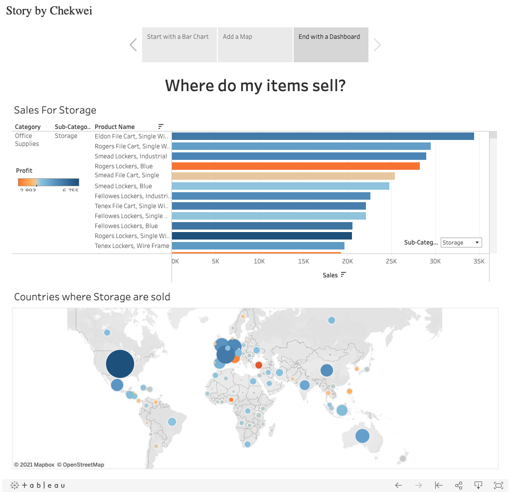

# Global_Superstore_Tableau_Viz
Mini Project on Global Superstore Data

# Objective 
To find out which product items are not helping with overall profits globally

To find out sales performance globally

To create an easy-to-follow Tableau story for audience

# Project 

Tableau Public URL:

https://public.tableau.com/app/profile/chekwei/viz/Global_Store_16246935986380/Story1

# Conclusions

Envelops, under Office Suypplies, have pretty good profits, especially in US (twice as much as China)

Tables, under Furniture, are losing money (negative profits) most in US and Indonesia. Tables are, however, making money in India and UK. 

Sales Team in US and Indonesia might want to focus on how to improve tables sales, or could draw insights from India/UK Sales Team who are doing very well. 

# Credits

Dataset: http://www.tableau.com/sites/default/files/training/global_superstore.zip
